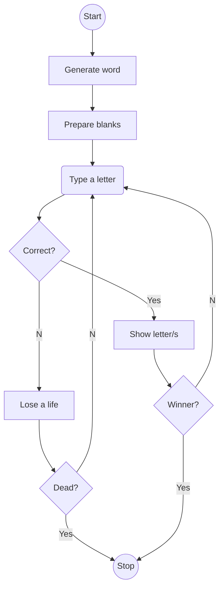

## Overview

### Lessons

1. For and While loops
1. If-Else statements
1. Lists
1. Strings
1. Range
1. Modules

### Project

- Hangman 🏗

## Hangman (game)

### Flowchart programming

```mermaid
flowchart TB
    Start((Start)) --> Generate[Generate word]
    Generate --> Prepare[Prepare blanks]
    Prepare --> Guess(Type a letter)
    Guess --> Check{Correct?}
    Check --Yes--> Reveal[Show letter/s]
    Check --No--> Hang[Lose a life]
    Hang --> Dead{Dead?}
    Dead --Yes--> Stop
    Dead --No--> Guess
    Reveal --> Winner{Winner?}
    Winner --No--> Guess
    Winner --Yes--> Stop((Stop))
```
