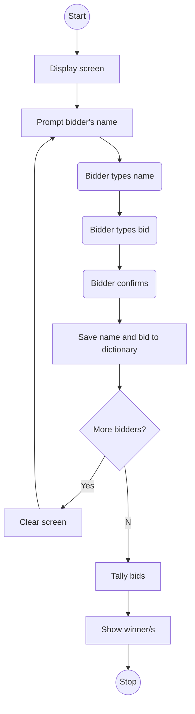

## Overview

### Lessons

1. Dictionaries
1. Nesting collections

### Project

- The Secret Auction 💰

## Dictionaries

- group together and tag related pieces of information together
- structured as key-value pairing of data

```py
# define dictionary
programming_dictionary = {
    "Bug": "An error in a program that prevents the program from running as expected.",
    "Function": "A piece of code that you can easily call over and over again.",
}
```

```py
# get item
print(programming_dictionary['Function'])
```

```py
# add item
programming_dictionary['Loop'] = "Doing something over and over again"
```

```py
# edit item
programming_dictionary['Bug'] = "A moth in your computer"
```

```py
student_scores = {
    "Harry": 81,
    "Ron": 78,
    "Hermione": 99,
    "Draco": 74,
    "Neville": 62,
}

# loop with key and value per item
for student, score in student_scores.items():
    print(student, score)
```

## Nesting

- collections inside a collection
- more flexible in storing different kinds of data

```py
# lists in a dictionary
travel_log = {
    "France": ["Paris", "Lille", "Dijon"],
    "Germany": ["Berlin", "Hamburg", "Stuttgart"],
}

# dictionaries in a dictionary
travel_log = {
    "France": {"cities_visited": ["Paris", "Lille", "Dijon"], "total_visits": 12},
    "Germany": {"cities_visited": ["Berlin", "Hamburg", "Stuttgart"], "total_visits": 5},
}

# dictionaries in a list
travel_log = [
{
    "country": "France",
    "cities_visited": ["Paris", "Lille", "Dijon"],
    "total_visits": 12,
},
{
    "country": "Germany",
    "cities_visited": ["Berlin", "Hamburg", "Stuttgart"],
    "total_visits": 5,
},
]
```

## The Secret Auction 💰


